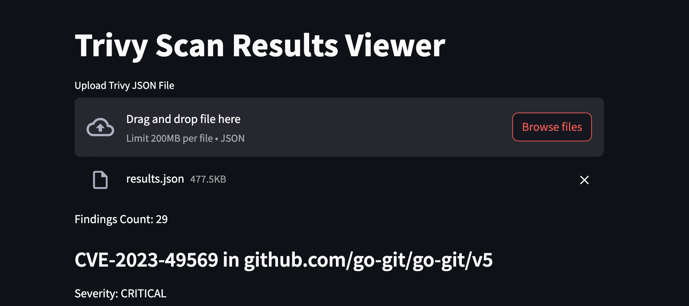

# trivy-streamlit



This is a simple UI to display JSON generated by the opensource scanner `trivy` from AquaSecurity, 
supported by the community.


Thanks to AquaSecurity for providing this great tool.

https://github.com/aquasecurity/trivy


## 🏗️ Dependencies

* trivy
* python3
* pip3

It is beyond the scope of this document to explain how to install either of those. 🗡️

## ⚙️ Generating JSON with trivy

```bash
trivy k8s --format json -o results.json --scanners=vuln --severity=CRITICAL --report=all cluster
```

## 🪇 Installing Streamlit

https://docs.streamlit.io/get-started/installation

```bash
pip install streamlit
```

## 🏃 Running Streamlit

```bash
streamlit run trivy-ui.py
```